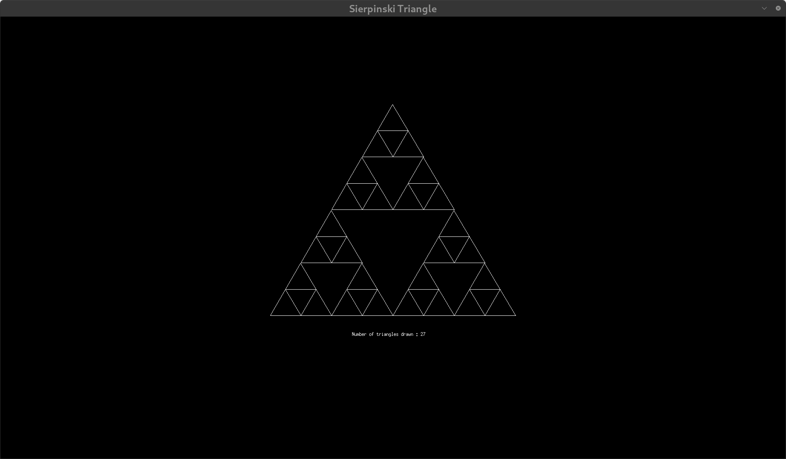
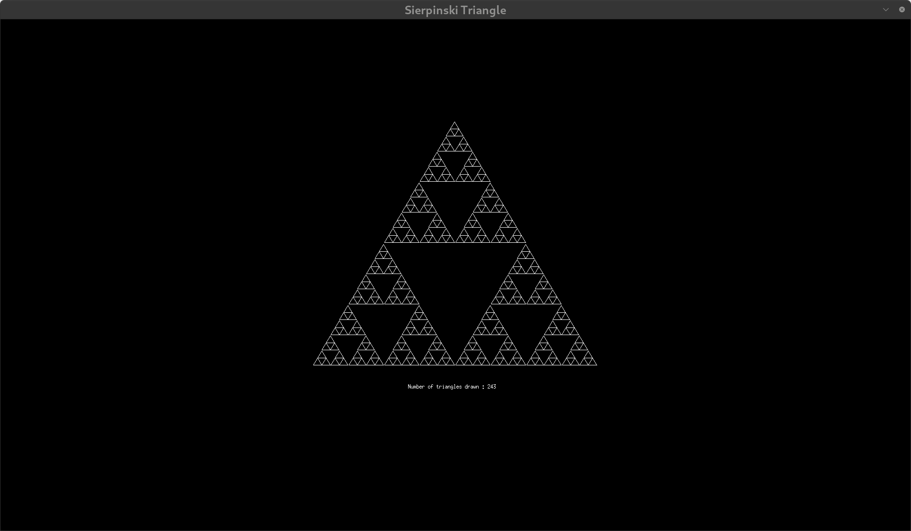
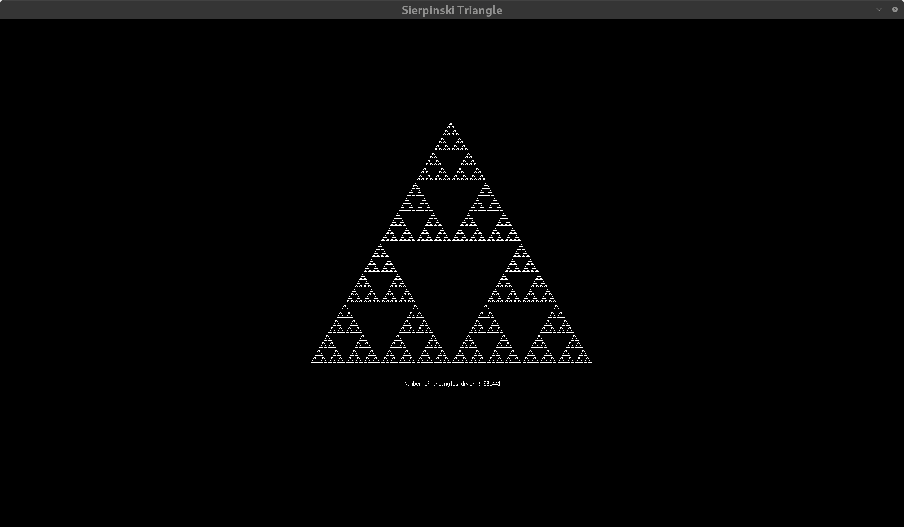

# Sierpinski Triangle 

A graphical application that renders the famous Sierpinski triangle fractal pattern using recursive geometry using the MLX library.

## Overview

The Sierpinski triangle is a self-similar fractal named after Polish mathematician Wacław Sierpiński. This visualizer allows you to explore this mathematical curiosity by specifying the recursion depth, generating increasingly complex patterns.

## Features

- Interactive visualization of the Sierpinski triangle fractal
- Custom iteration depth control
- Real-time display of total triangles rendered (follows 3^n formula)
- Clean, minimalist interface
- Easy exit with ESC key

## Technical Requirements

- C compiler (CC recommended)
- MinilibX graphics library
- X11 development libraries

## Building the Project

```bash
# Clone the repository
git clone https://github.com/msabir42/Sierpi-ski-triangle.git
cd sierpinski-triangle

# Compile the project
make
```

## Running the Visualizer

```bash
./sierpinski_triangle <iterations>
```

Where `<iterations>` is a positive integer that determines the fractal depth.

### Examples

```bash
# Generate a basic Sierpinski triangle (depth 3)
./sierpinski_triangle 3

# Generate a more detailed fractal (depth 7)
./sierpinski_triangle 7
```

**Note:** Higher iteration values create more detailed patterns but require more computation. Values above 10 may significantly impact performance depending on your system.

## Controls

- **ESC**: Close the application

## Implementation Details

This visualizer is implemented in C using the MinilibX library. The fractal is generated using a recursive algorithm that follows these steps:

1. Start with a single triangle
2. Divide it into four equal triangles
3. Remove the center triangle
4. Recursively apply the same process to the remaining triangles
5. Stop when the specified iteration depth is reached

The total number of triangles drawn follows the formula 3^n, where n is the iteration depth.

## Screenshots

### Iteration 3


### Iteration 6


### Iteration 10

